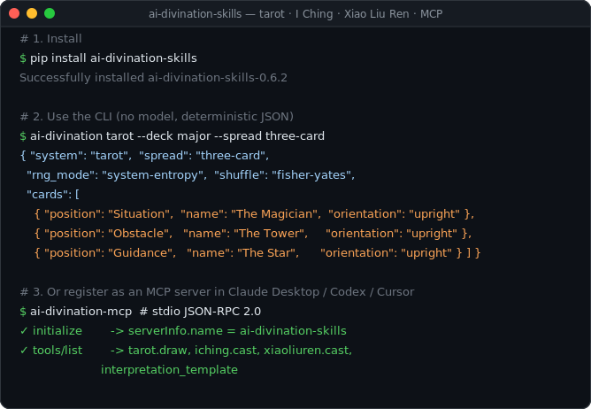

# AI 占卜 Skills

<!-- mcp-name: io.github.sapuyou45-bit/ai-divination-skills -->

[English](README.md) | [简体中文](README.zh-CN.md) | [日本語](README.ja.md)


<p align="center">
  <a href="https://pypi.org/project/ai-divination-skills/">
    
  </a>
</p>

[](https://github.com/sapuyou45-bit/ai-divination-skills/actions/workflows/tests.yml)
[](https://github.com/sapuyou45-bit/ai-divination-skills/actions/workflows/release.yml)
[](https://pypi.org/project/ai-divination-skills/)
[](https://pypi.org/project/ai-divination-skills/)
[](https://github.com/sapuyou45-bit/ai-divination-skills/releases)
[](https://opensource.org/licenses/MIT)
[](https://github.com/sapuyou45-bit/ai-divination-skills/actions/workflows/tests.yml)
[](https://github.com/sapuyou45-bit/ai-divination-skills/discussions)

✨ 给 AI agent 使用的开源占卜技能集：工具负责随机、抽牌和起课，**AI 只负责解读**具体结果。

`ai-divination-skills` 是一个实用的 skill 集合，覆盖塔罗、易经、小六壬，以及后续更多象征系统。它面向 agent 工作流，强调可审计的随机过程、清晰的方法边界，以及可复用的解读模板。

本项目将占卜视为象征推理与反思工具，而不是确定性预言。

## ✨ 项目概览

很多 AI 占卜 prompt 会让模型自己编出结果。本项目把两件事分开：

1. 本地脚本生成牌面、卦象或小六壬位置。
2. AI agent 基于具体结果，在安全边界内进行解释。

这样读法更容易测试、复现、审计，也更适合在不同 agent 中复用。

## 🧭 方法论严谨性

核心规则很简单：脚本或用户提供的实体占卜结果负责生成牌面、卦象或位置；AI 只解释这个已经生成的结果，不负责生成占卜结果本身。

这不是在证明占卜具有科学有效性，而是让象征推理工作流更严格：

- 真实 reading 默认使用系统随机
- seed 只用于测试和可复现 demo
- 每个 skill 都记录传统方法和限制
- JSON 输出包含可审计的方法元数据
- 近似模式必须输出 warning，不能伪装成传统准确起法

## 🌐 多语言文档

GitHub Pages 根页面现在默认显示简体中文；如果要切到 English 或 日本語，直接用页面顶部的语言切换即可。

[打开线上页面](https://sapuyou45-bit.github.io/ai-divination-skills/)

本地预览：

```bash
python3 -m http.server 8000 -d docs
```

线上页面：

```text
https://sapuyou45-bit.github.io/ai-divination-skills/
```

## 🧩 已包含 Skills

| Skill | 作用 | 脚本 |
|---|---|---|
| `tarot` | 用于反思、决策、创作卡点和项目复盘的塔罗抽牌。 | `skills/tarot/scripts/draw.py` |
| `iching` | 生成六爻易经卦象，输出本卦与之卦。 | `skills/iching/scripts/cast.py` |
| `xiaoliuren` | 使用农历式数字或轻量公历时间 fallback 起小六壬。 | `skills/xiaoliuren/scripts/cast.py` |

## 🚀 快速开始

从 PyPI 安装：

```bash
pip install ai-divination-skills
```

或者从本地 checkout 安装：

```bash
pip install .
```

开发时可以用 editable 模式：

```bash
pip install -e .
```

三个体系使用同一个入口：

```bash
ai-divination tarot --deck major --spread three-card --reversals
ai-divination iching --method yarrow
ai-divination xiaoliuren --method numbers --month 3 --day 12 --hour 7
```

查看给 agent 使用的解读模板：

```bash
ai-divination template tarot
```

也可以直接用 Python API：

```python
from ai_divination_skills.tarot import draw
from ai_divination_skills.iching import cast
from ai_divination_skills.xiaoliuren import cast_numbers
```

也可以继续直接运行底层脚本：

```bash
python3 skills/tarot/scripts/draw.py --deck major --spread three-card --reversals
python3 skills/iching/scripts/cast.py --method coins
python3 skills/iching/scripts/cast.py --method yarrow
python3 skills/xiaoliuren/scripts/cast.py --method numbers --month 3 --day 12 --hour 7
```

需要可复现 demo 时使用 seed：

```bash
python3 skills/tarot/scripts/draw.py --spread decision --seed demo
python3 skills/iching/scripts/cast.py --method yarrow --seed demo
```

所有脚本都会输出 JSON。

## 📦 安装为 Agent Skills

把需要的 skill 文件夹复制到 agent 的 skill 目录：

```bash
cp -R skills/tarot ~/.codex/skills/tarot
cp -R skills/iching ~/.codex/skills/iching
cp -R skills/xiaoliuren ~/.codex/skills/xiaoliuren
```

每个 skill 都是自包含目录：

```text
skills/name/
  SKILL.md
  agents/openai.yaml
  scripts/
  references/
```

如果只需要某个 skill，复制对应单个文件夹即可。

每个 skill 脚本也支持单文件夹模式。如果已经安装 Python package，脚本会调用包内 runtime；如果只复制了 skill 文件夹，脚本会退回到该 skill 自带的 standalone 脚本。

## 🧠 在 Claude Desktop / Codex 等 MCP 宿主里使用

`ai-divination-skills` 自带 **MCP server**（`ai-divination-mcp`）。任何支持
[Model Context Protocol](https://modelcontextprotocol.io/) 的宿主 —— Claude Desktop、Codex、
Continue、Cursor —— 都能用一行配置挂载它，模型会得到 4 个工具：
`tarot.draw`、`iching.cast`、`xiaoliuren.cast`、`interpretation_template`。

模型永远不会自己编造结果；server 在本地运行经过审计的脚本。

### Claude Desktop 配置

```bash
pip install ai-divination-skills
```

然后编辑 `~/Library/Application Support/Claude/claude_desktop_config.json`（macOS）或
`%APPDATA%\Claude\claude_desktop_config.json`（Windows）：

```json
{
  "mcpServers": {
    "divination": {
      "command": "ai-divination-mcp"
    }
  }
}
```

重启 Claude Desktop。之后对它说"帮我抽三张塔罗看一下今天的决策"即可。

## 🤖 Agent 行为

每个 skill 都要求 agent：

- 生成或接受一个具体的抽取/起卦结果
- 只在需要时读取简洁参考资料
- 使用共享响应协议解释
- 避免确定性、宿命论和专业建议

共享规范位于：

- `shared/methodology.md`
- `shared/interpretation-protocol.md`
- `shared/response-contract.md`
- `shared/randomness-protocol.md`
- `shared/safety-policy.md`
- `shared/interpretation-style.md`

## 🧪 示例

- `examples/tarot-decision.md`
- `examples/iching-strategy.md`
- `examples/xiaoliuren-daily.md`

## 🛡️ 安全边界

这些 skills 不用于医疗、法律、金融或危机处置建议。

好的解读应该：

- 将结果表述为象征性反思
- 将主要判断连接到脚本生成的结果
- 保留用户自主性
- 给出小而可逆的下一步
- 清楚说明不确定性

完整立场见 `ETHICS.md`。

## 🛠️ 开发

除 Python 3 外没有运行依赖。

运行测试：

```bash
python3 -m unittest discover -s tests
```

## 🗺️ 路线图

近期：

- 增加正式发布 Python package 的 workflow。
- 继续扩展 CI 中的自动 skill validation。
- 为 MVP skills 增加更丰富的参考资料。
- 增加更多示例解读。
- 增加更多 agent 集成例子。

后续：

- `meihua`
- `liuyao`
- `runes`
- `numerology`
- `astrology`

## 📄 License

MIT
